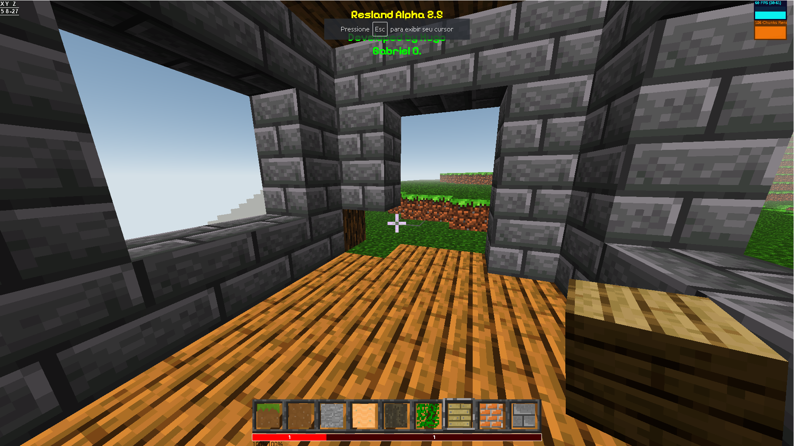

# Resland 



## Um jogo web voxel

## Aviso:
Utilize navegadores baseado em chromium

### Criado usando apenas Javascript

## Instalando:

```bash
git clone https://github.com/Hg777Br/Resland
cd Resland
npm install
```

## Executando:
```bash
npx vite
```

##  Configurando:

Dentro da pasta "game/scripts/constants.js" é possivel configurar alguns parametros.
